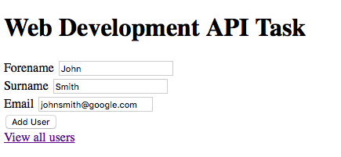
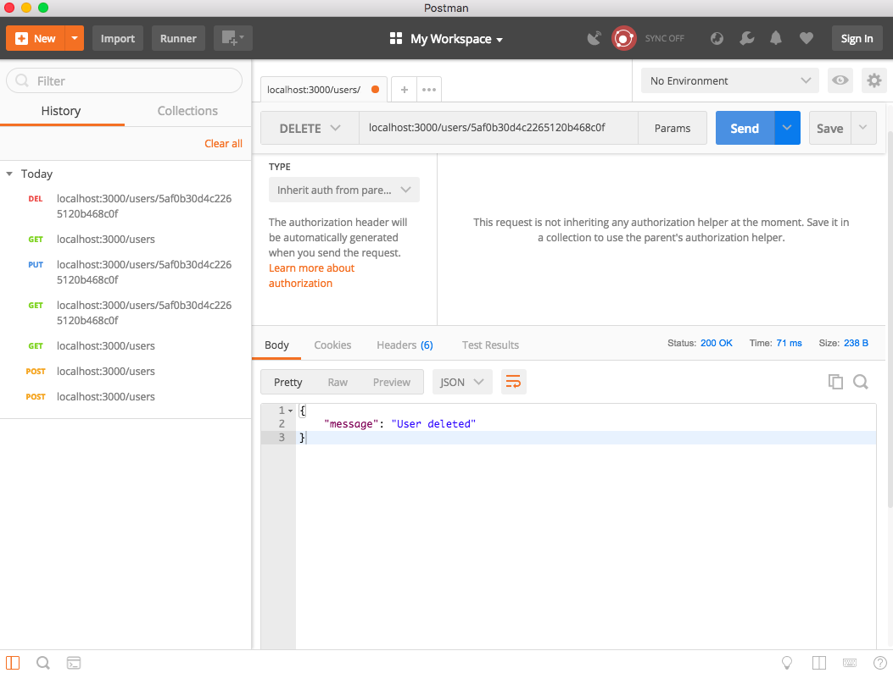

# Web Development API Task

[Start using it now!](https://web-dev-api-heather-stock.herokuapp.com)

Enter the users details and click `Add User` `View all users`

View list of users. 
Click `View / edit user` to edit.

View the users details and edit them using the form.
Click `Update User` (email address changed from google to gmail)

View the updated details. 

Users are updated to the mLab database. 

## Otherwise use with Postman:

### Requirements

* MongoDB and Mongod
* [Node and npm](https://nodejs.org/en/)
* Postman

### Installation

Install MongoDB and Mongod

`git clone https://github.com/heatherstock/API`

Run `git checkout nofrontend` to navigate to correct branch

Run `npm install` to download dependencies

Create a `config.json` file and place your own MongoDB URI within test and development environment variables

### Usage

Run `mongod` in background

Run `node server.js` to launch app

Open Postman and follow the images to interact with the database

Input users into the database:
Copy `localhost:3000/users` into the url space and choose `POST`. 
Click `body` `raw` and input data in the same format as you see it:
`{"forename": "", "surname": "", "email": ""}`
Click `send`

View users in the database:
Choose `GET` `send`

You can see on the left hand side I have made 2 post requests and I have 2 users in the database. 

Copy and paste a users ID after the url, remember to separate with a "/" `localhost:3000/users/:id`
Choose `GET` `send`

Edit the users details in the same format as you input them earlier. 
Choose `PUT` `send`

Remove the `/:id` after `localhost:3000/users` 
Notice the user's data has been updated. 

Finally, copy and paste a users ID after the url, remember to separate with a "/" `localhost:3000/users/:id`
Choose `DELETE` `send`

You can now emove the `/:id` after `localhost:3000/users` 
Notice the user's data has been deleted (not shown).

### Running Tests

Run `git checkout master` to navigate to correct branch

Run `mongod` in background

Run `node server.js` to launch app

`npm run cypress` to run feature tests via cypress.io

NOTE: You must have an empty database to run the tests. Please make sure you remove all records or drop the collection.

#### A note about the branches: 

The files on the 'master' branch include a views folder annd a cypress testing suite folder for behaviour driven development of implement a front-end to the API. This is what has been deployed to heroku. 

The files on the 'nofrontend' branch do not include a views folder and therefore there is no front-end implementation. This is what has been used to show how the API can be used with Postman, as HTML does not allow PUT and DELETE methods (these have had to be replaced with POST methods in the 'master' branch). 

The files in the 'docker' branch include some Docker files which I have tried to implement. Still a work in progress. 

## Approach to development:

### Before starting:

- Decide on language and frameworks
- 'Brain dump' ideas, questions, areas of ignorance
- Decide how to TDD

I decided to use Node.js, Express and Mongodb to build the API, as this was the stack used during my final project at Maker's Academy. This meant that I could embed the knowledge learned during the project and build upon the areas we struggled with and improve my knowledge at the same time. For example, that app definitely flouted the Single Responsibilty Principle by not encapsulating the routes and controllers. 

Therefore I did a more research into the conventions of Node.js and Express in order to better set out the routes and controllers. 
I also decidedd to use all three MVC components. This way I would also have practice linking the back-end to the front-end, something I have not spent as much time as I wanted to during Makers Academy. 

Since I was implementing front-end, I chose to use behaviour driven development using Cypress. 

### Actual process of development:

- Set up server, database, schema and define routes - CRUD. 
- Define the methods in the controller for the routes. 
- Make very simple view files using BDD to implement the functionality of the back-end via the front-end. 
- Deploy with Heroku and mLab. 

The development of the back-end was surprisingly easy after I had spent time researching my areas of ignorance I had noted down before I started. I also had the benefit of learning from the mistake we made in our last project. However, I could not find a simple way of test driving the development. Therefore I used Cypress to allow me to test drive the API from a user perspective through the browser, with the back-end already set up. 

I originally used GET, POST, PUT and DELETE HTTP methods in my routes, but soon found that PUT and DELETE are not supported by HTML, and so changed them both to POST in order of the API to work in the browser. This did not impact the functionality of the API, but I decided to make a branch here and keep the original methods intact, for clear use with Postman. 

Another change I made was in the schema, to use Date.now rather than timestamps. Although timestamps has an 'updatedAt' value, I decided the simplicity of Date.now matched the attributes listed in the task. 

Deploying to Heroku wasn't as easy as I was expecting. I put this down to lack of experience using Heroku, and also not using mLab before, to host the database. For example, I spent time uninstalling and installing a downgraded version of mongodb, as much of the online literature and my error messages pointed to incompatible versions of the mongo shell and server. After thoroughly going through the heroku logs, I found the problem was not using `app.listen(process.env.PORT)`. This is an important learning curve, as it comes down to my team at Makers being so focussed on the product we were building, we didn't take the time to sit down with the person who deployed the app and ask him to share his knowledge with us. 

### Blockers:

- Not 'brain dumping' at strategic times
- Taking on too much

As I mentioned above, I also chose to try to create a Dockerfile. Since I had never used Docker before, this was a big challenge - one I still have yet to solve! This definitely added some pressure in completing the task, and in hindsight I can clearly see when there were times I should have put all my thoughts down on paper, to expose questions and areas of ignorance, as I did before starting the task. This would have also helped solve my heroku problem much more quickly too. 

### If I had more time:

- Docker
- CSS
- TDD

I definitely want to spend more time researching Docker and how to link in the database. You can see my attempt in the 'docker' branch. 
Another skill I would like to improve is my CSS. It's something that I don't find as fun or rewarding as more back-end development, simply because I haven't devoted as much time to it and therefore don't have the skills yet to get into 'flow' when using it. 

I would like to look into test driving an API like this in more detail and how more experienced engineers would approach the problem.

## Key Learnings

- Take the time to share knowledge
- Don't bite off more than you can chew
- Two heads are better than one (even when the second head is a rubber duck)

When working together as a team, the team should be more than just a sum of it's parts. To achieve this, it's not only ideas that should be shared within the team, but knowledge. It's no use if one of the team knows everything about xyz if he then gets hit by a bus (hypothetically speaking). I definitely learned this the hard way with deploying to Heroku. Such a seemingly simple thing confounded me for a long time, because I didn't take the time to ask my team mate to share his experience with me at the time. 

What added to this stress was 'rushing' so I could have time to create a Dockerfile, something I had never attempted before. I like a challenge, and I'm glad I tried to make the Dockerfile. I'm also glad I've decided to leave it for another day. 

What solved the issue was taking five minutes to everything to a very patient boyfriend who knows nothing about "Rocoku". 

